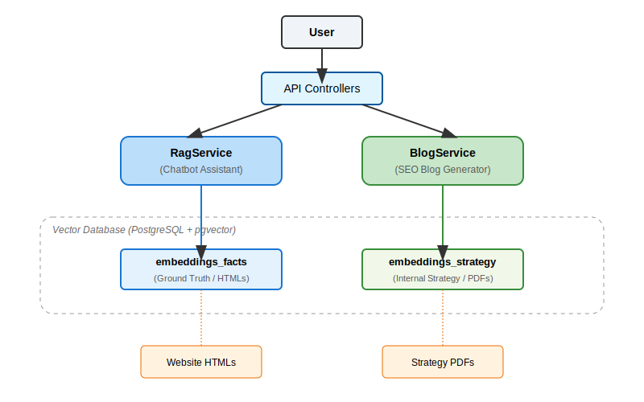

# Luminous Morocco Tours - RAG AI Assistant

A sophisticated Retrieval-Augmented Generation (RAG) system built for **Luminous Morocco Tours**. This application serves two distinct purposes using a **Dual-Store Architecture** to ensure factual accuracy and strategic alignment.

## 🌟 Key Features

### 1. The "Native Curator" Chatbot
*   **Goal:** Answer customer questions about tours, the owner (Hamid), and logistics.
*   **Source of Truth:** Strictly limited to the company's website content (`html` files).
*   **Safety:** Physically isolated from internal strategy documents to prevent hallucinating competitor info.

### 2. The SEO Blog Generator
*   **Goal:** Generate high-quality, "Native Voice" travel blogs compatible with WordPress/Yoast.
*   **Source of Truth:** Uses internal Strategy Guides (`pdf` files) + Company Facts.
*   **Style:** Adheres to the "Native Curator" persona (warm, insider, authoritative).

---

## 🏗 Architecture

We solved the "Poisoned Context" problem (where AI mixes up company facts with competitor analysis) by implementing a **Separation of Concerns** architecture:



*   **Fact Store:** Contains cleaned text from `src/main/resources/knowledge-base/raw-data` (HTMLs).
*   **Strategy Store:** Contains text from `src/main/resources/knowledge-base/documents` (PDFs).

---

## 🛠 Tech Stack

*   **Framework:** Spring Boot 4.0.0
*   **AI Orchestration:** LangChain4j 1.9.1
*   **LLM:** Google Gemini 2.5 Flash / 2.5 Flash Lite (via `langchain4j-google-ai-gemini`)
*   **Vector Database:** PostgreSQL 16 with `pgvector` extension (Dockerized)
*   **Tools:** Jsoup (HTML cleaning), Apache PDFBox (PDF parsing)

---

## 🚀 Getting Started

### Prerequisites
*   **Java 21**
*   **Docker Desktop** (for the database)
*   **Google Gemini API Key**

### 1. Start the Database
The application requires a PostgreSQL database with `pgvector`. We use Docker:

```bash
# Pull and run the container
docker run -d --name luminous-pgvector -p 5432:5432 -e POSTGRES_USER=postgres -e POSTGRES_PASSWORD=postgres -e POSTGRES_DB=luminous_rag pgvector/pgvector:pg16
```

### 2. Set your API Key
You need to set the `GEMINI_API_KEY` environment variable.

**Windows (PowerShell):**
```powershell
$env:GEMINI_API_KEY="your_actual_api_key_here"
```

**Mac/Linux:**
```bash
export GEMINI_API_KEY="your_actual_api_key_here"
```

### 3. Run the Application
The application will automatically ingest documents and set up the database schema on startup.

```bash
mvn spring-boot:run
```

*Note: On every startup, the application performs a "Nuke and Pave" (clears the database and re-ingests data) to ensure you are always working with the latest files. See [RAG_CHALLENGES.md](RAG_CHALLENGES.md) for architectural details on why we split the stores.*

### 4. Access the UI
Open your browser and go to:
👉 **http://localhost:8080**

---

## 📂 Project Structure

*   `src/main/resources/knowledge-base/raw-data`: Place website HTML files here.
*   `src/main/resources/knowledge-base/documents`: Place strategy PDFs here.
*   `src/main/java/.../config/AiServicesConfiguration.java`: **Critical wiring**. This is where Services are bound to specific Retrievers.
*   `src/main/java/.../services/KnowledgeBaseIngestor.java`: Handles the splitting and loading of data into the correct tables.

## 📝 Troubleshooting

**"Port 5432 already in use"**
*   Stop your local Postgres or the old Docker container: `docker stop luminous-pgvector` then `docker rm luminous-pgvector`.

**"Hallucinations about Competitors"**
*   Check `AiServicesConfiguration.java` to ensure `RagService` is strictly using `factsRetriever`.
